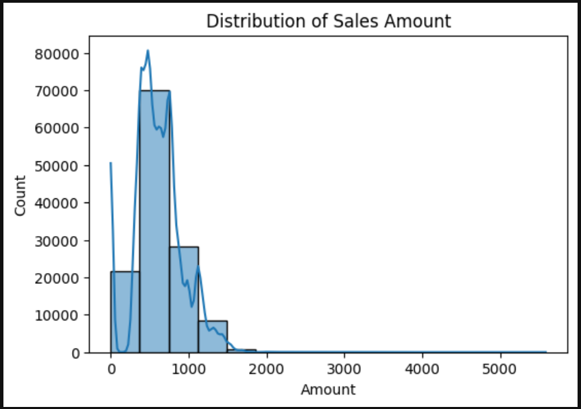
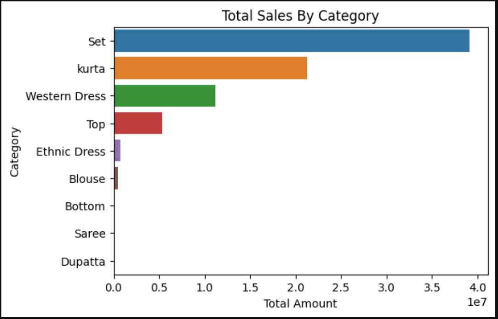
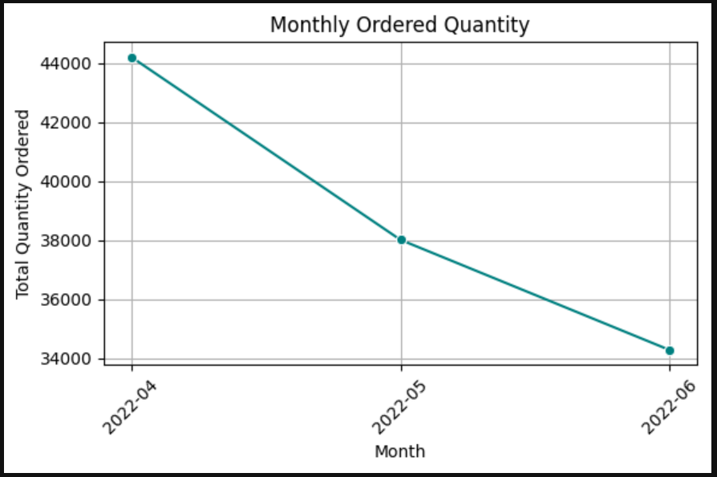

# 📦 Amazon India Sales - Exploratory Data Analysis

This project is an Exploratory Data Analysis (EDA) of Amazon India’s domestic sales data. It aims to uncover insights into product performance, category trends, city-wise demand, and seasonal patterns.

## 🔍 Objectives
- 🔧 Cleaning and preprocessing raw data
- 📊 Univariate analysis of key features (e.g., category, product, sales)
- 🔄 Bivariate analysis to explore relationships between variables.
- 📈 Visualizing trends and patterns using Python libraries.
- 🧹 Categorizing cities into Tier 1, 2, and 3 for granular insights

## 🖼️ Sample Visuals

📊 Future Work
A Power BI dashboard will be created using the same dataset to provide interactive visualizations.

📁 Dataset
- Source: [Kaggle - E-Commerce Sales Dataset](https://www.kaggle.com/datasets/thedevastator/unlock-profits-with-e-commerce-sales-data)
- Credits: All data belongs to the original creator on Kaggle.

## 🛠️ Tools Used
- Python (Pandas, NumPy, Matplotlib, Seaborn)
- Jupyter Notebook
- Power BI (planned)

## 🧑‍💻 Author
Kaushal Pawar - [LinkedIn](www.linkedin.com/in/kaushalpawar-0208k) | [GitHub](https://github.com/kaushalpawar-02)
